# 🏏 Cricket Scorecard App

> A full-stack real-time cricket scoring platform built with Spring Boot and React


---

## ✨ Features

- 🔐 **JWT Authentication** with role-based access control
- 🏏 **Complete ball-by-ball scoring** — runs, extras (wide, no-ball, bye, leg-bye), wickets, free hits
- 📡 **Real-time live score updates** via WebSocket (STOMP over SockJS)
- 🔑 **Private match keys** — each match gets a unique shareable key for spectators
- 📊 **Analytics dashboard** with charts — run rate progression, top scorers, top wicket-takers
- 📄 **PDF scorecard download** — full match report generated with iText 7
- 🏆 **Full innings & match management** — toss, batting first, innings break, 2nd innings, final result
- 👥 **Player profiles** with batting/bowling styles, roles, and per-match performance stats

---

## 📸 Screenshots

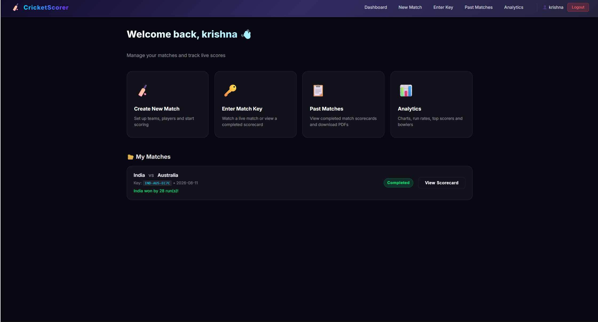

---

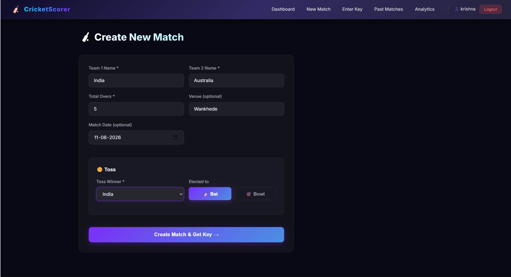

---

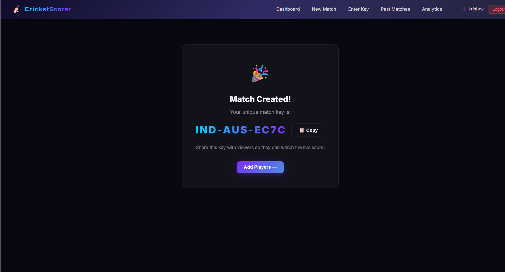

---

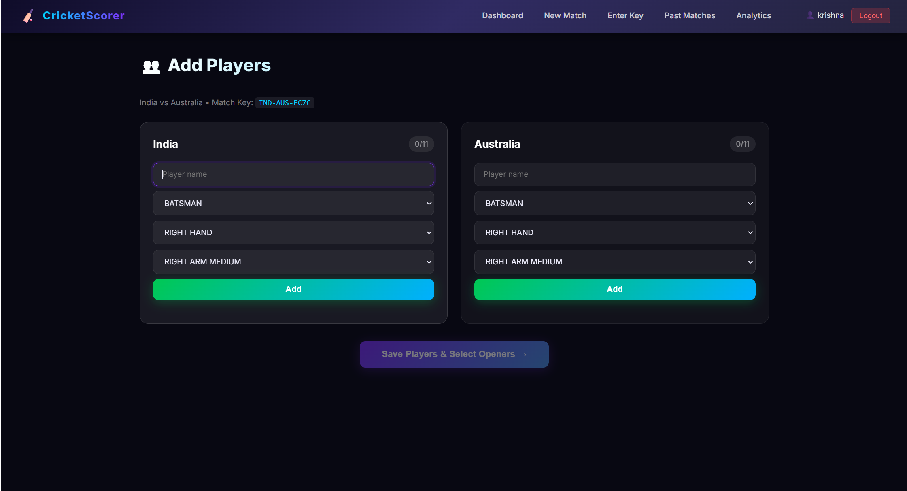

---

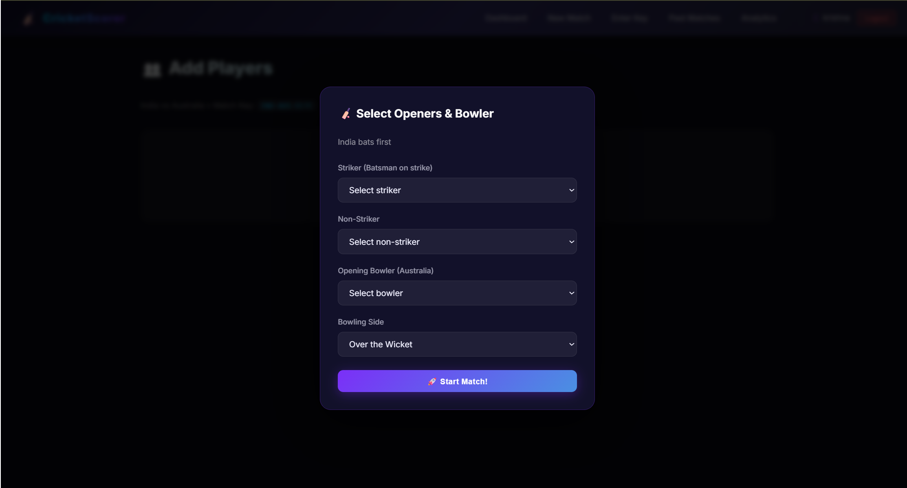

---

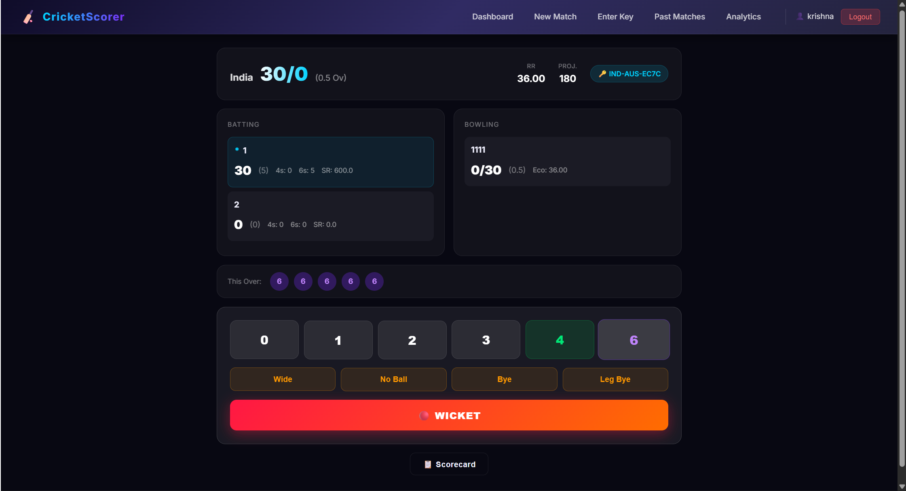

---

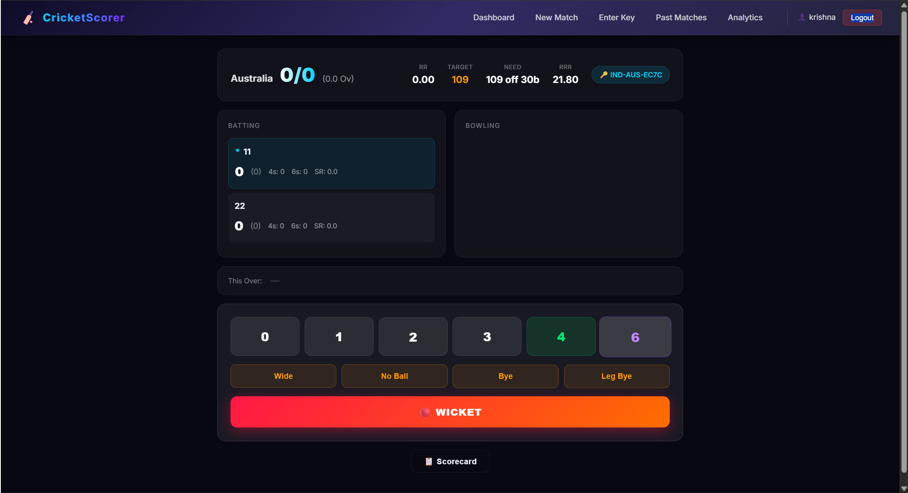

---

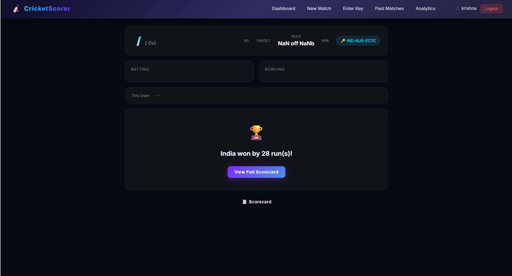

---

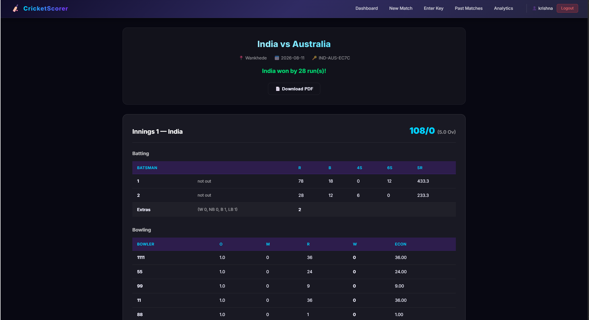

---

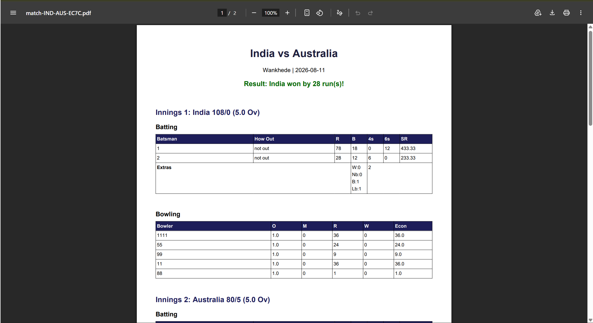

---

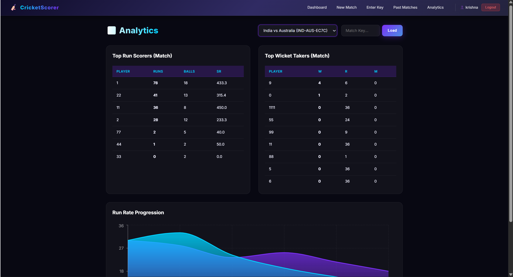

---

## 🚀 How to Run

### Prerequisites
- Java 17+
- Maven 3.8+
- Node.js 18+
- npm 9+

### Backend

```bash
cd backend
mvn spring-boot:run
```

The backend starts on **http://localhost:8080**

### Frontend

```bash
cd frontend
npm install
npm start
```

The frontend starts on **http://localhost:3000**

---

## 🔑 Default Login Credentials

| Field    | Value         |
|----------|---------------|
| Username | `HarshShringi` |
| Password | `Harsh1234`   |

> You can register new accounts from the Login page.

---

## 🔐 How Match Keys Work

1. When you create a new match, the system generates a **unique alphanumeric key** (e.g., `IND-UII-AB12`).
2. Share this key with anyone — they can enter it on the **"Enter Key"** page to watch live scores as a spectator in real time.
3. Only the **match creator** can control scoring; spectators get a read-only live view that auto-updates via WebSocket.

---

## 📡 API Endpoints

### Authentication

| Method | Endpoint             | Description                   |
|--------|----------------------|-------------------------------|
| POST   | `/api/auth/register` | Register a new user           |
| POST   | `/api/auth/login`    | Login and receive a JWT token |

### Matches

| Method | Endpoint                           | Description                              |
|--------|------------------------------------|------------------------------------------|
| GET    | `/api/matches/my`                  | Get all matches created by current user  |
| POST   | `/api/matches`                     | Create a new match                       |
| GET    | `/api/matches/{matchKey}`          | Get match details by key                 |
| POST   | `/api/matches/{matchKey}/players`  | Add players to both teams                |
| GET    | `/api/matches/{matchKey}/players`  | Get all players of a match               |
| POST   | `/api/matches/{matchKey}/start`    | Start innings (select openers & bowler)  |

### Scoring

| Method | Endpoint                                    | Description                         |
|--------|---------------------------------------------|-------------------------------------|
| POST   | `/api/scoring/{matchKey}/ball`              | Record a ball delivery              |
| POST   | `/api/scoring/{matchKey}/wicket`            | Record a wicket                     |
| POST   | `/api/scoring/{matchKey}/next-batsman`      | Bring in next batsman after wicket  |
| POST   | `/api/scoring/{matchKey}/next-bowler`       | Select next bowler after an over    |
| GET    | `/api/scoring/{matchKey}/scorecard`         | Get full live scorecard             |

### Analytics

| Method | Endpoint                                    | Description                                    |
|--------|---------------------------------------------|------------------------------------------------|
| GET    | `/api/analytics/top-scorers`                | All-time top run scorers                       |
| GET    | `/api/analytics/top-bowlers`                | All-time top wicket takers                     |
| GET    | `/api/analytics/{matchKey}/top-scorers`     | Top scorers for a specific match               |
| GET    | `/api/analytics/{matchKey}/top-bowlers`     | Top wicket takers for a specific match         |
| GET    | `/api/analytics/{matchKey}/run-rate`        | Over-by-over run rate chart data               |
| GET    | `/api/analytics/{matchKey}/summary`         | Match summary (scores, result)                 |

### PDF

| Method | Endpoint                             | Description                         |
|--------|--------------------------------------|-------------------------------------|
| GET    | `/api/pdf/{matchKey}`                | Download full match scorecard as PDF |

---

## 🗂️ Project Structure

```
CricketScorecardApp/
├── backend/                        # Spring Boot Application
│   ├── src/main/java/com/cricket/scorecard/
│   │   ├── config/                 # Security, WebSocket, CORS config
│   │   ├── controller/             # REST API controllers
│   │   │   ├── AuthController.java
│   │   │   ├── MatchController.java
│   │   │   ├── ScoringController.java
│   │   │   ├── AnalyticsController.java
│   │   │   └── PdfController.java
│   │   ├── service/                # Business logic
│   │   │   ├── ScoringService.java # Core scoring engine
│   │   │   ├── AnalyticsService.java
│   │   │   └── PdfService.java
│   │   ├── model/                  # JPA entity classes
│   │   ├── repository/             # Spring Data JPA repositories
│   │   └── dto/                    # Request/Response DTOs
│   ├── src/main/resources/
│   │   └── application.properties  # DB config, JWT secret, CORS
│   └── pom.xml
│
├── frontend/                       # React Application (Create React App)
│   ├── src/
│   │   ├── context/                # AuthContext (JWT state)
│   │   ├── services/               # api.js (Axios), websocket.js (STOMP)
│   │   ├── components/             # Navbar, ProtectedRoute
│   │   └── pages/                  # All page components
│   │       ├── LoginPage.jsx
│   │       ├── Dashboard.jsx
│   │       ├── MatchSetup.jsx
│   │       ├── PlayerSetup.jsx
│   │       ├── LiveScoring.jsx
│   │       ├── WatchLive.jsx
│   │       ├── Analytics.jsx
│   │       ├── PastMatches.jsx
│   │       └── Scorecard.jsx
│   ├── package.json
│   └── public/
│
├── ORIGINAL_APP_ANALYSIS.md
├── plan2.md
└── README.md
```

---

## 🛠️ Tech Stack Details

| Layer      | Technology           | Purpose                              |
|------------|----------------------|--------------------------------------|
| Backend    | Spring Boot 3.x      | REST API, WebSocket broker           |
| Database   | SQLite + JPA/Hibernate | Lightweight persistent storage     |
| Security   | Spring Security + JWT | Stateless authentication            |
| Real-time  | STOMP over SockJS    | Live score broadcasting              |
| Frontend   | React 18 (CRA)       | Single-page application              |
| HTTP       | Axios                | API calls with JWT interceptor       |
| Charts     | Recharts             | Run rate area charts                 |
| PDF        | iText 7              | Match scorecard generation           |
| Styling    | Vanilla CSS          | Glassmorphism dark theme             |

---

## 📝 License

This project is built for educational and personal use.

---

<p align="center">Made with ❤️ by <strong>HarshShringi</strong></p>
